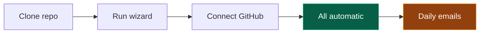

# Job Hunter AU

Automated job discovery for Australia. Upload your resume, AI parses your skills, then GitHub Actions scrapes 5 job boards daily and emails you ranked results.

**Zero hosting required** - just a profile file and a GitHub Actions cron job.

## Demo


## Screenshots

| Landing Page | Profile Editor |
|:-:|:-:|
|  |  |

| Scoring Weights | Export JSON |
|:-:|:-:|
|  |  |

| GitHub Automation | Email Digest |
|:-:|:-:|
|  |  |

## How It Works



> **You** - clone, configure, connect. **The app** - forks, commits profile, sets secrets, enables cron. **Every day** - scrapes 5 boards, scores jobs, emails you.

## Quick Start

> **Do not fork this repo first.** Clone it, run the wizard, and the app will fork and configure everything for you.

### 1. Clone and run the wizard

```bash
git clone https://github.com/elvistranhere/job-hunter.git
cd job-hunter/web
cp .env.example .env        # Add your GEMINI_API_KEY (optional - you can skip AI)
npm install
npm run dev                  # Opens on localhost:3006
```

### 2. Configure your profile

1. Upload your resume PDF (or click "Continue without AI" to set up manually)
2. Customize skill tiers, scoring weights, locations, and roles
3. Adjust search settings (max hours, results per search, seniority filters)

### 3. Connect GitHub and deploy

On the automation page, click **Connect GitHub** and authorize. The app will automatically:

- Fork this repo to your account
- Commit your `profile.json` to the repo root
- Set Gmail secrets (`GMAIL_USER`, `GMAIL_APP_PASSWORD`, `EMAIL_TO`)
- Enable the daily cron workflow and trigger the first run

You'll receive an email with ranked job results within ~15 minutes. After that, the cron runs daily at 9pm UTC (7am AEST).

> **Gmail App Password**: You'll need one for the email digest. Go to [Google Account > App Passwords](https://myaccount.google.com/apppasswords), generate one for "Mail", and enter it during setup. Requires 2-Step Verification.

<details>
<summary><strong>Alternative: CLI or manual setup</strong></summary>

### CLI Only (no web app)

```bash
cp profile.example.json profile.json   # Edit with your skills, locations, roles
uv sync
uv run python scrape.py --profile profile.json
GMAIL_USER=you@gmail.com GMAIL_APP_PASSWORD=xxxx EMAIL_TO=you@gmail.com \
  uv run python email_digest.py --profile profile.json
```

### Manual GitHub Actions (without OAuth)

1. **Fork this repo** - click [Fork](https://github.com/elvistranhere/job-hunter/fork)
2. **Commit `profile.json`** to the repo root:
   ```bash
   git add -f profile.json && git commit -m "Add my profile" && git push
   ```
3. **Set repository secrets** in **Settings > Secrets and variables > Actions**:
   | Secret | Value |
   |--------|-------|
   | `GMAIL_USER` | Your Gmail address |
   | `GMAIL_APP_PASSWORD` | [Gmail App Password](https://myaccount.google.com/apppasswords) (16-character) |
   | `EMAIL_TO` | Comma-separated recipient emails |
4. **Enable Actions** - click "I understand my workflows, go ahead and enable them"
5. **Uncomment the cron** in `.github/workflows/daily-jobs.yml`:
   ```yaml
   schedule:
     - cron: '0 21 * * *'   # 9pm UTC = 7am AEST
   ```
6. **Run workflow** - **Actions > Daily Jobs > Run workflow**

</details>

## Job Boards

| Board | Method |
|-------|--------|
| Indeed | HTTP scraping |
| Seek | Browser automation (nodriver) |
| Prosple | GraphQL API |
| GradConnection | HTTP scraping |
| LinkedIn | HTTP scraping |

## Scoring

Jobs are scored on 8 weighted dimensions (all configurable in `profile.json`):

| Category | Base Points | What It Measures |
|----------|------------|-----------------|
| Skills Match | 55 | Core/strong/peripheral skill matches + adjacency |
| Location | 20 | Preferred cities + remote bonus |
| Title Match | 18 | Job title vs. your professional identity |
| Culture | 15 | Remote-first, equity, flex hours, learning budget |
| Company Tier | 12 | Big Tech, AU Notable, Top Tech companies |
| Sponsorship | 12 | Visa sponsorship signals |
| Job Quality | 12 | Salary transparency, detailed descriptions |
| Recency | 10 | Newer postings score higher |

### profile.json Reference

The web app generates this file; CLI flags are optional overrides.

| Field | Type | Default | Description |
|-------|------|---------|-------------|
| `skills` | array | - | Skills with tiers: `core`, `strong`, `peripheral` |
| `titles` | string[] | - | Professional titles for title matching |
| `keywords` | string[] | - | Search terms for job boards |
| `locations` | string[] | - | Australian cities to search |
| `roles` | string[] | - | Role titles to search for |
| `weights` | object | all `1.0` | Scoring multipliers (0 = off, 2 = double) |
| `maxHours` | number | `24` | Max hours since posted |
| `resultsPerSearch` | number | `20` | Results per search per site |
| `excludeSeniority` | string[] | `["senior","lead",...]` | Seniority levels to filter out |
| `minScore` | number | `20` | Minimum score for email digest |

## Project Structure

```text
profile.example.json        Starter profile template
scrape.py                   Orchestration + scoring engine
scrapers_au.py              Job board scrapers (5 sources)
email_digest.py             HTML email rendering + SMTP
web/                        Next.js app (profile wizard)
.github/workflows/          CI + daily automation
```

## Environment Variables

**Web app** (`web/.env`):
- `GEMINI_API_KEY` - Google AI key for resume parsing (optional - you can skip AI)
- `NEXT_PUBLIC_GITHUB_CLIENT_ID` - OAuth client ID for automated setup. A default is included in `.env.example`; the app handles the rest

**GitHub Actions secrets**:
- `GMAIL_USER` - Gmail address
- `GMAIL_APP_PASSWORD` - Gmail app password
- `EMAIL_TO` - Comma-separated recipient emails

## Contributing

See [CONTRIBUTING.md](CONTRIBUTING.md).

## License

[MIT](LICENSE)
